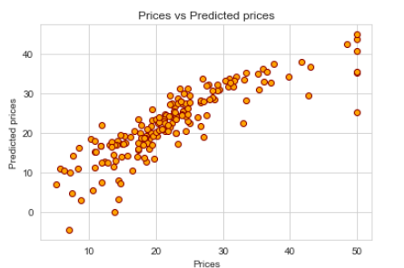
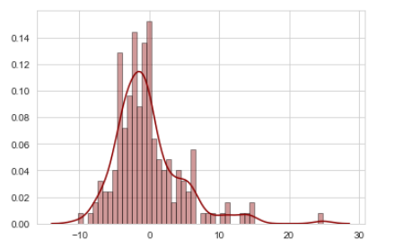

## Predicting Boston Housing Prices


The main goal of the project is to obtain an optimal model based on a statistical data to estimate the best price for a customer to buy a house in Boston, Massachusetts. 

### Boston Housing Dataset 
The dataset used for this project is included in scikit-learn library (sklearn.datasets.load_boston) which the data collected from homes in suburbs of Boston, Massachusetts. The expense of a house varies according to various factors like average number of rooms per dwelling, full-value property-tax rate per $10,000,  pupil-teacher ratio, crime rate, etc. 

Attribute Information (in order) :
        
        1. CRIM     per capita crime rate by town
        2. ZN       proportion of residential land zoned for lots over 25,000 sq.ft.
        3. INDUS    proportion of non-retail business acres per town
        4. CHAS     Charles River dummy variable (= 1 if tract bounds river; 0 otherwise)
        5. NOX      nitric oxides concentration (parts per 10 million)
        6. RM       average number of rooms per dwelling
        7. AGE      proportion of owner-occupied units built prior to 1940
        8. DIS      weighted distances to five Boston employment centres
        9. RAD      index of accessibility to radial highways
        10. TAX      full-value property-tax rate per $10,000
        11. PTRATIO  pupil-teacher ratio by town
        12. B        1000(Bk - 0.63)^2 where Bk is the proportion of blacks by town
        13. LSTAT    % lower status of the population
        14. MEDV     Median value of owner-occupied homes in $1000's
## Now let's start 

### Import libraries 
First we must import the following Python libraries :

* numpy - for arrays and matrix processing with the help of a large collection of high-level mathematical functions
* pandas - for data analysis
* matplotlib.pyplot - for data visualization
* seaborn - for making statistical graphics in Python and data visualization library based on matplotlib

```python3
import numpy as np 
import pandas as pd 
import seaborn as sns
sns.set_style('whitegrid')
import matplotlib.pyplot as plt
%matplotlib inline

```
### Load the dataset
Now we are going to import the Boston Housing dataset and store it in a variable called boston_data.
```python3

from sklearn.datasets import load_boston
boston_data = load_boston()
```
#### Print all keys for boston_data
```python3
boston_data.keys()
```
*Out : dict_keys(['data', 'target', 'feature_names', 'DESCR', 'filename'])*

#### Print all attributes under the key 'feature_names'
```python3
boston_data.feature_names
```
*Out  : array(['CRIM', 'ZN', 'INDUS', 'CHAS', 'NOX', 'RM', 'AGE', 'DIS', 'RAD', 'TAX', 'PTRATIO', 'B', 'LSTAT'], dtype='<U7')*

### Now let's view the description of the dataset.

```python3
boston_data.DESCR
```


*(partial image of the output)*

#### print the dimensions of data
```python3
boston_data.data.shape
```
*Out  : (506, 13)*

#### print the dimensions of target

```python3
boston_data.target.shape
```
*Out  : (506,)*

### Load the data into a DataFrame

```python3
# Load boston_data into bos_df
bos_df = pd.DataFrame(boston_data.data)
bos_df.columns = [boston_data.feature_names]

# Return first 5 rows
bos_df.head()
```


### Generate descriptive statistics
```python3
bos_df.describe()
```


*(partial image of the output)*

### Assign x and y
**x** and **y** are two DataFrames the will be used to train the data model.

**x** will hold the values that will be used for prediction (All attributes except Housing Price)

**y** will hold the target values (Housing Price)

```python3
x = bos_df
y = pd.DataFrame(boston_data.target)
```

### Exploratory Data Analysis

Exploratory data analysis (EDA) is an approach to analyzing data sets to summarize their main characteristics, often with visual methods. A statistical model can be used or not, but primarily it is for seeing what the data can tell us beyond the formal modeling or hypothesis testing task. Exploratory Data Analysis is an important step before training the model.
```python3
bos = pd.DataFrame(boston_data.data, columns=boston_data.feature_names)
bos['MEDV'] = boston_data.target
```

Now let’s plot the distribution of the target variable 'MEDV'

```python3
sns.set(rc={'figure.figsize':(11.7,8.27)})
sns.distplot(bos['MEDV'], bins=30)
plt.show()
```


Now we will create a correlation matrix that measures the linear relationships between the variables

```python3
correlation_matrix = bos.corr().round(2)
sns.heatmap(data=correlation_matrix, annot=True)
```


### Algorithm : 
#### Linear regression algorithm
Linear regression algorithm is one of the fundamental supervised machine-learning algorithms due to its relative simplicity and well-known properties.Regression is a method of modelling a target value based on independent predictors. It is mostly used for forecasting and finding out cause and effect relationship between variables.

Simple linear regression is a type of regression analysis where the number of independent variables is one and there is a linear relationship between the independent(x) and dependent(y) variable.
```
y = mx + c
```

To know more about Linear regression algorithm, [Click here](https://towardsdatascience.com/introduction-to-machine-learning-algorithms-linear-regression-14c4e325882a)

### Import scikit-learn libraries
```python3
from sklearn import linear_model
from sklearn.model_selection import train_test_split
```

#### Initialize the linear regression model

```python3
l_reg = linear_model.LinearRegression()
```

### Splitting the data into training and testing data

#### Here we are splitting data into 65% training data and 35% testing data.

```python3
x_train, x_test, y_train, y_test = train_test_split(x, y, test_size=0.35, random_state=57)
```

### Training the model

```python3
l_reg.fit(x_train, y_train)
```

*Out  : LinearRegression(copy_X=True, fit_intercept=True, n_jobs=None, normalize=False)*


### Coefficients
Print the coefficients for each column of our data model

```python3
coeff_df = pd.DataFrame(l_reg.coef_.flatten() ,x.columns, columns=['Coefficient'])
coeff_df
```


#### Display the Intercept

```python3
print(l_reg.intercept_)
```
*Out  : [44.32583168]*


### Predictions
```python3
predictions = l_reg.predict(x_test)
```

#### Print the actual price of houses from the y_test data 
```python3
y_test[0]
```
*Out  :*

```
318    23.1
309    20.3
449    13.0
464    21.4
494    24.5
       ... 
240    22.0
51     20.5
135    18.1
424    11.7
186    50.0
Name: 0, Length: 178, dtype: float64
```

Let us see the Price for the second row from y_test data where the actual price is 20.3
```python3
# print the prediction for the second row of y_test data actual price = 20.3
predictions[1]
```
*Out  : array([23.59851573])*

### Now plot Actual Prices vs Predicted prices graph

```python3
plt.scatter(y_test, predictions, edgecolor='Darkred', color='orange')
plt.xlabel('Prices')
plt.ylabel('Predicted prices')
plt.title('Prices vs Predicted prices')

```



```
sns.distplot((y_test - predictions), bins = 50, hist_kws=dict(edgecolor="black", linewidth=1),color='Darkred')
```



### Now let's check model accuracy

#### Mean Squared Error (MSE) : 
The mean of the distance from each point to the predicted regression model can be calculated and shown as the mean squared error.

```python3
from sklearn.metrics import mean_squared_error

print(mean_squared_error(y_test, predictions))
```
*Out  :  23.026198484642887*

```python3
l_reg.score(x_test,y_test)
```
*Out  :  0.7368039496310854*

### We got an accuracy of 73.68%

The accuracy of this model is lower than 85%. 

So How do we improve our model?

To answer this, we will use a different method called gradient boosting regressor, which is very important for weak prediction models such as this.

### Using Gradient Boosting Regressor

**Gradient boosting** is a machine learning technique for regression and classification problems, which produces a prediction model in the form of an ensemble of weak prediction models. It builds the model in a stage-wise fashion like other boosting methods do, and it generalizes them by allowing optimization of an arbitrary differentiable loss function. 

To know more about Gradient Boosting algorithm [click here](https://machinelearningmastery.com/gentle-introduction-gradient-boosting-algorithm-machine-learning/)


```python3
from sklearn import ensemble
gbr = ensemble.GradientBoostingRegressor(n_estimators=500, max_depth=3, min_samples_split=3, learning_rate=0.3, loss='ls')
gbr.fit(x_train,np.ravel(y_train,order='C'))
```

*Out :*

```
GradientBoostingRegressor(alpha=0.9, ccp_alpha=0.0, criterion='friedman_mse',
                          init=None, learning_rate=0.3, loss='ls', max_depth=3,
                          max_features=None, max_leaf_nodes=None,
                          min_impurity_decrease=0.0, min_impurity_split=None,
                          min_samples_leaf=1, min_samples_split=3,
                          min_weight_fraction_leaf=0.0, n_estimators=500,
                          n_iter_no_change=None, presort='deprecated',
                          random_state=None, subsample=1.0, tol=0.0001,
                          validation_fraction=0.1, verbose=0, warm_start=False)
```
### New Predictions
```python3
new_predictions = gbr.predict(x_test)
```
### Once again plot Prices vs Predicted prices graph
```python3
plt.scatter(y_test, new_predictions, edgecolor='Darkred', color='orange')
plt.xlabel('Prices')
plt.ylabel('Predicted prices')
plt.title('Prices vs Predicted prices')
```


### Print the new prediction for the second row from our y_test data

```python3
new_predictions[1]
```
*Out :  19.736771278364603*
```python3
gbr.score(x_test,y_test)
```

Here we can observe that the original prediction was 23.59851573 and the new prediction is 19.73677127 for the actual price = 20.3


*Out :  0.9067518792184023*

### We got an accuracy of 90.67%!!

For the code, [Click here](Predicting%20Boston%20Housing%20Prices.ipynb) to view the notebook
